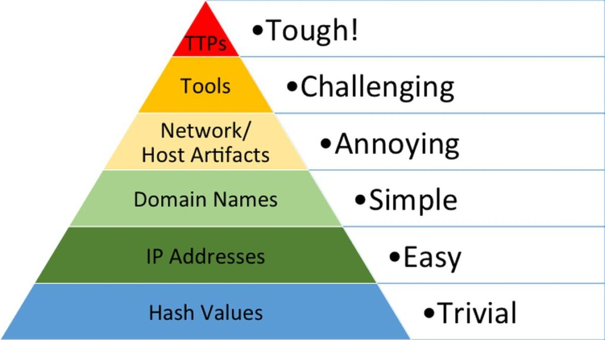

# Pyramid of Pain — Consolidated Notes

**Core idea:** Not all evidence of an attacker is equally useful. The pyramid ranks indicators by *how much pain* it causes an attacker when you detect and act on that indicator — pain meaning "how much time/effort/money he must spend to keep attacking you."

**The rule to remember:** The higher up the pyramid, the harder it is for the attacker to change — because you're no longer detecting a disposable resource, you're detecting *him* (his behavior, his tools, his methodology).

**As David Bianco states**, "the amount of pain you cause an adversary depends on the types of indicators you are able to make use of". 

---

## The 7 Levels (bottom → top)

| # | Level | Color | Pain | What it actually is | Why it's (not) painful | Real example | Your weapon as defender |
|---|---|---|---|---|---|---|---|
| 1 | **Hash Values** | — | Trivial | A file's unique digital fingerprint (MD5/SHA-1/SHA-256) | Changing 1 byte of the file = totally new hash. Costs attacker seconds. | `echo "x" >> file.exe` changes the hash instantly | VirusTotal, MetaDefender (hash lookup) |
| 2 | **IP Address** | Green | Easy | The numeric address a device uses on a network | Attacker just grabs a new IP. Fast Flux makes it worse — one domain rotates across many IPs constantly. | Botnet proxy IPs hiding a C2 server | Firewall IP blocking (weak alone) |
| 3 | **Domain Names** | Teal | Simple | Text name mapped to an IP (e.g. `evilcorp.com`) | Costs money + registration to get a new one — slightly harder, but APIs make it easy to automate. Punycode & URL shorteners hide malicious domains. | `adıdas.de` (Punycode trick) or a bit.ly link | Proxy/DNS logs, checking Punycode, appending `+` to shortened URLs |
| 4 | **Host Artifacts** | Yellow | Annoying | Evidence left *on the infected machine* (registry keys, dropped files, weird process behavior) | Attacker must change his tool's *behavior on-disk* — real rework, takes days. | Word spawning PowerShell unexpectedly | EDR, process monitoring, registry monitoring |
| 5 | **Network Artifacts** | Yellow | Annoying | Evidence left *in network traffic* (User-Agent strings, C2 patterns, URI patterns) | Attacker must change how his malware talks on the wire — also real rework. | Emotet's unique User-Agent string | Wireshark/TShark, Snort/IDS, PCAP analysis |
| 6 | **Tools** | Orange | Challenging | The actual malware/software itself (maldocs, backdoors, custom EXE/DLL, stealers) | Losing the tool = attacker must buy/build a replacement or retrain on a new one. Real cost. | `Stealer.exe` malware sample | YARA rules, AV signatures, fuzzy hashing (SSDeep), MalwareBazaar, SOC Prime |
| 7 | **TTPs** | Red | **Tough** | Tactics, Techniques & Procedures — the attacker's entire playbook (MITRE ATT&CK) | Catching this = catching *how he thinks and operates*, not just what he used. He must retrain his whole approach or give up. | Detecting a Pass-the-Hash attack via Windows Event Logs | MITRE ATT&CK mapping, behavioral detection, Event Log monitoring |

---

## Quick mental model (burglar analogy)
- **Hash** = a single grain of sand from his shoe (meaningless alone)
- **IP** = his getaway car's license plate (swap the car)
- **Domain** = his fake ID (costs him to make a new one)
- **Host/Network Artifacts** = his fingerprints and tools left at the scene (he must change his methods)
- **Tool** = the actual lockpick set he used (he must buy/build a new one)
- **TTP** = *the way he breaks in, every single time* (he'd have to become a different burglar entirely)

- **Revise** -
https://youtu.be/O7PSKrgdHAI?si=ibjB3G0wFfHXdLbx
## One-line takeaway per level (fast recall)
1. Hash → breaks with one byte change
2. IP → attacker just gets a new one
3. Domain → costs money/registration, but automatable
4. Host Artifact → forces on-machine behavior change
5. Network Artifact → forces on-wire behavior change
6. Tool → forces attacker to replace his entire weapon
7. TTP → forces attacker to relearn his whole method, or quit

**Bottom line:** aim your detection as high up the pyramid as possible — TTPs and Tools give you the most lasting advantage; hashes and IPs give you the least.